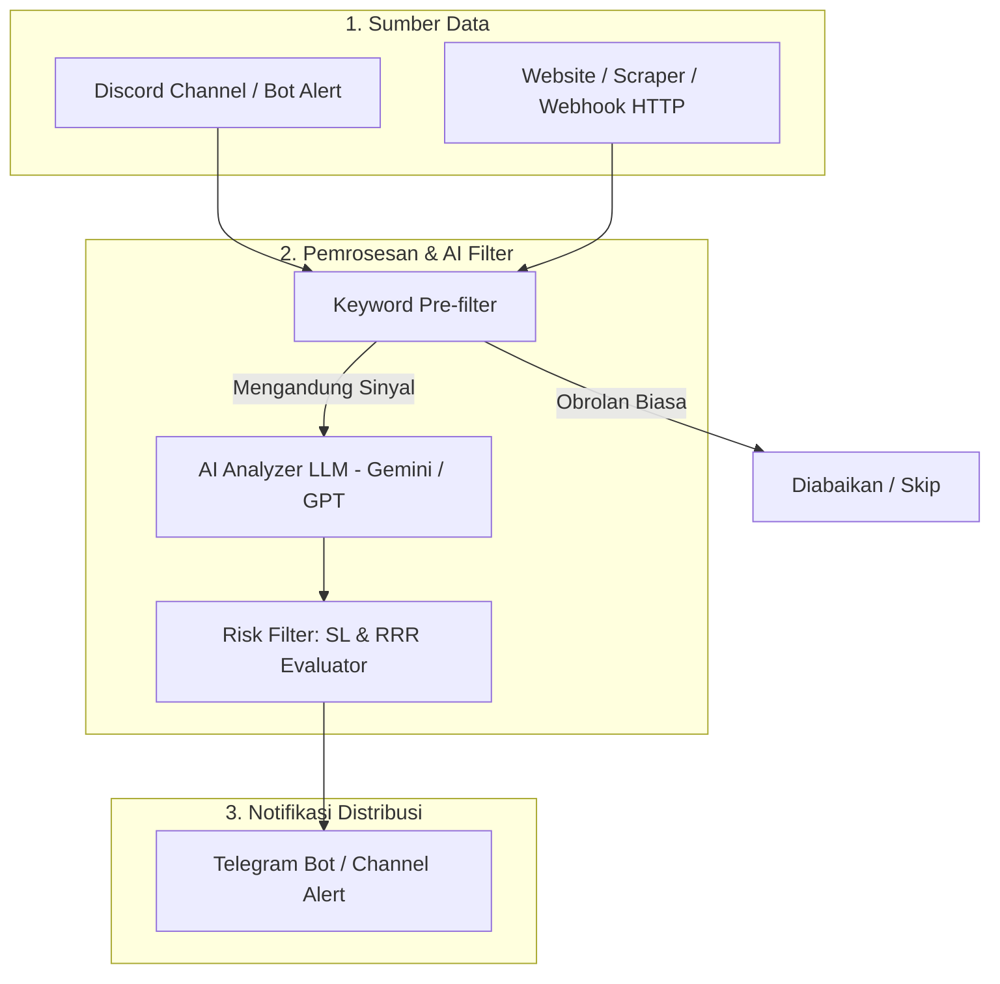

# 🚀 Call EANovaire — AI Stock Signal Automation

Program otomasi sinyal trading saham cerdas berbasis AI (**Gemini / OpenAI**). Sistem ini memantau alert mentah dari **Discord** dan **Website/Webhook**, mengekstrak parameter trading (Ticker, Action, Entry, TP, SL, RRR), menerapkan filter manajemen risiko, dan meneruskan notifikasi yang terformat rapi ke **Telegram**.

---

## 🏛️ Arsitektur Sistem



---

## 📂 Struktur Project

```text
EA Analisis Saham/
│
├── config.py                 # Manajemen konfigurasi & pembacaan file .env
├── main.py                   # Entry point aplikasi (Discord + Webhook runner)
├── requirements.txt          # Daftar dependensi library Python
├── .env.example              # Template variabel lingkungan & API credentials
├── README.md                 # Dokumentasi lengkap & panduan penggunaan
│
├── models/
│   └── signal.py             # Schema data sinyal (Pydantic Model)
│
├── services/
│   ├── ai_analyzer.py        # Engine ekstraksi & filter AI (Gemini / OpenAI)
│   ├── discord_listener.py   # Listener pesan Discord dengan intent support
│   ├── telegram_notifier.py  # Pengirim notifikasi Telegram dengan format HTML
│   └── webhook_server.py     # Server REST API / Webhook (FastAPI)
│
└── utils/
    └── logger.py             # Sistem logging terpusat
```

---

## ⚙️ Persyaratan Sistem & Instalasi

### 1. Buat Virtual Environment & Install Dependensi
Buka terminal (PowerShell atau Command Prompt) di folder project ini:

```bash
# Aktifkan virtual environment yang sudah dibuat
.\.venv\Scripts\activate

# Jalankan simulasi test
python main.py --test

# Atau cukup klik ganda file run_bot.bat untuk menjalankan bot secara langsung!
```

---

## 🔑 Panduan Konfigurasi Kredensial (.env)

Salin template `.env.example` menjadi `.env`:
```bash
copy .env.example .env
```

Buka file `.env` lalu sesuaikan isinya:

### A. Konfigurasi AI Engine
Pilih provider yang Anda inginkan:
- **Google Gemini (Direkomendasikan)**:
  1. Dapatkan API Key gratis di [Google AI Studio](https://aistudio.google.com/).
  2. Isi `AI_PROVIDER=gemini` dan `GEMINI_API_KEY=AIzaSy...`.
- **OpenAI**:
  1. Dapatkan API Key di [OpenAI Platform](https://platform.openai.com/).
  2. Isi `AI_PROVIDER=openai` dan `OPENAI_API_KEY=sk-proj-...`.

### B. Konfigurasi Telegram
1. Buat bot baru di Telegram melalui [@BotFather](https://t.me/BotFather), ketik `/newbot`, lalu salin **HTTP API Token** ke `TELEGRAM_BOT_TOKEN`.
2. Dapatkan Chat ID Anda atau Channel ID:
   - Kirim pesan ke bot Anda, lalu buka browser: `https://api.telegram.org/bot<TOKEN_ANDA>/getUpdates`
   - Atau gunakan bot [@userinfobot](https://t.me/userinfobot) untuk mendapatkan ID pribadi Anda.
   - Jika ke Channel/Group: jadikan bot Anda sebagai **Administrator**, lalu masukkan Chat ID (biasanya diawali `-100...`).
3. Masukkan ke `TELEGRAM_CHAT_ID`.

### C. Konfigurasi Discord (Listener)
1. Buka [Discord Developer Portal](https://discord.com/developers/applications).
2. Buat **New Application** -> buka menu **Bot** -> Klik **Reset Token** lalu salin token ke `DISCORD_BOT_TOKEN`.
3. **PENTING**: Di menu **Bot**, scroll ke bagian **Privileged Gateway Intents** dan aktifkan toggle:
   - ✅ **MESSAGE CONTENT INTENT** (wajib agar bot bisa membaca isi pesan).
4. Invite bot ke server Discord Anda melalui menu **OAuth2 -> URL Generator** (centang scope `bot`, permissions: `Read Messages/View Channels`, `Read Message History`).
5. Copy ID channel yang ingin dipantau (klik kanan channel -> *Copy Channel ID*) dan tempel di `DISCORD_CHANNEL_IDS`.

---

## 🚀 Menjalankan Program

### 1. Uji Coba Simulasi Cepat (Testing Mode)
Jalankan perintah ini untuk memastikan AI dan Notifikasi Telegram Anda berfungsi normal tanpa harus menunggu sinyal masuk dari Discord:

```bash
python main.py --test
```
*Sistem akan mengekstrak contoh sinyal saham BBCA dan langsung mengirimkannya ke Telegram Anda.*

### 2. Menjalankan Bot Secara Penuh
```bash
python main.py
```
Bot akan otomatis:
- Mendengarkan channel Discord yang telah ditentukan.
- Mengaktifkan Webhook HTTP Server di port `8000`.

---

## 🌐 Menerima Sinyal dari Website / Scraper / TradingView (Webhook)

Jika Anda memiliki script scraping website atau alert dari TradingView, Anda dapat langsung mengirim data mentah ke endpoint webhook:

**Endpoint**: `POST http://localhost:8000/webhook/signal`  
**Payload**:
```json
{
  "text": "ALERT: Saham TLKM BUY area 3700-3750, TP 3950, SL 3600. Rebound volume akumulasi.",
  "source": "Web Scraper IDX"
}
```

**Contoh eksekusi via cURL:**
```bash
curl -X POST http://localhost:8000/webhook/signal -H "Content-Type: application/json" -d "{\"text\": \"BUY ANTM entry 1550 TP 1680 SL 1500 RRR 1:2.6\", \"source\": \"TradingView Webhook\"}"
```

---

## 🛡️ Aturan Manajemen Risiko (Risk Filter)
Sistem secara otomatis menandai sinyal sebagai **🚨 RISIKO TINGGI** jika:
1. **Stop Loss (SL)** tidak ditentukan atau ambigu.
2. **Risk to Reward Ratio (RRR)** bernilai lebih rendah dari **1:1.5**.
3. Tingkat keyakinan teknikal AI bernilai **LOW**.
